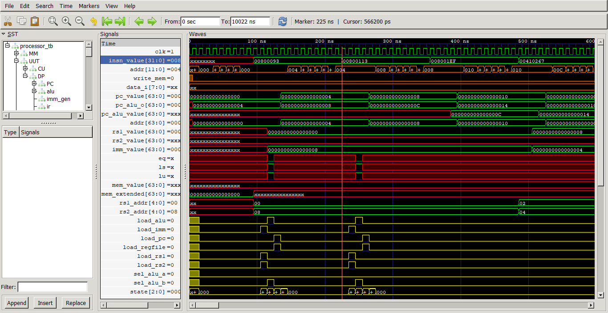
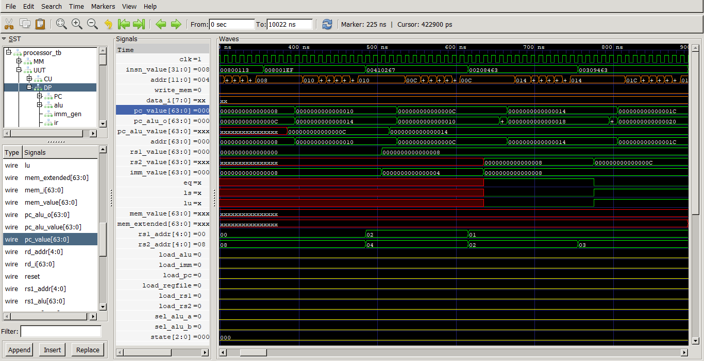
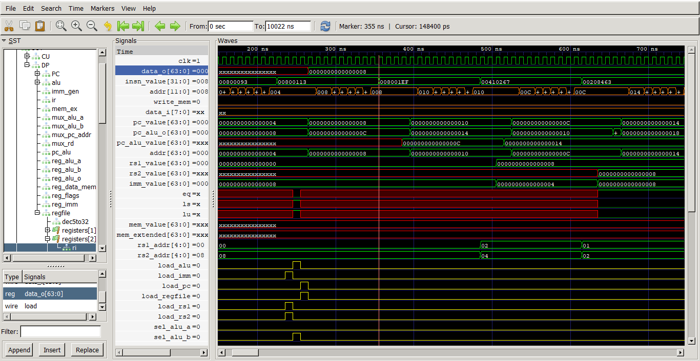
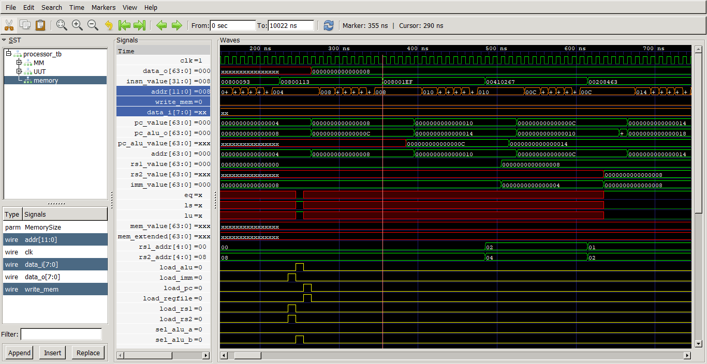
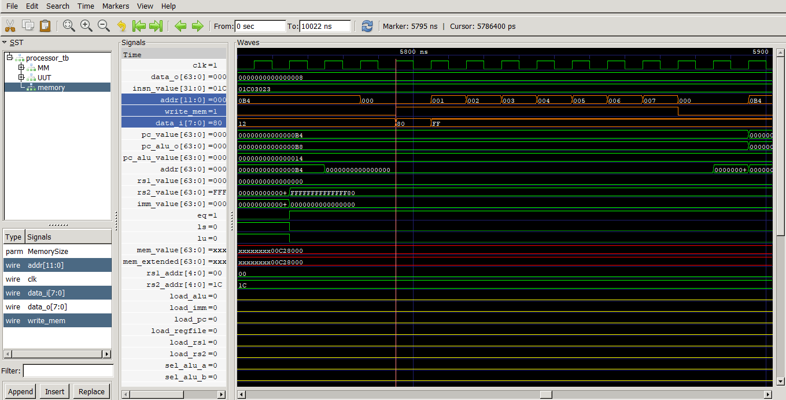

# Processador RISC-V 64I

Um processador que implementa a arquitetura RISC-V com a extensão I (operação com números inteiros), para palavras de 64 bits.

# Descrição

O processador foi feito seguindo a ISA do RISC-V, sendo capaz de executar as instruções previstas nela, tais como: operações de aritmeticas entre registradores e com imediatos, operações de controle e manipulação de dados entre elementos de memória e operações de saltos/condicionais. 

Ele executa as instruções em multiclo, obedecendo quatro estados principais: fetch, decode, execute e writeback. Cada instrução passa por esses estados, podendo demorar mais ou menos ciclos para finalizá-los, dependendo de sua complexidade.

OBS: Ainda não foram implementadas instruções CSR e fence.

# Compilação

Para realizar a compilação dos arquivos, utiliza-se `iverilog -o <nome da saída> <caminho do(s) arquivo(os)>` presente na ferramenta iverilog e utilizamos `vvp <Nome da saída gerada na compilação>` para realizar a simulação de algum testbench. 

Também é possível utilizar a *makefile* presente neste projeto, para facilitar a compilação de um grande número de arquivos.

> Exemplo de compilação de um arquivo
> ~~~
>iverilog -o test src/cpu/DataFlow/decoder.v
> ~~~

> Exemplo de realização de uma simulação
> ~~~
>vvp test
> ~~~

# Makefile
Este projeto contem uma makefile utilizada para compilar todos os arquivos verilog presentes no projeto. 

### Comandos

~~~shell
make compile
~~~

Comando principal, utilizado para compilar todos os arquivos e algum testbench selecionado. Utiliza-se "*target=*" seguido do nome de algum arquivo de *testbench" (presente na pasta testbenches). Exemplo principal de utilização: 

> ~~~
>make compile target=processor_tb.v
> ~~~

~~~shell
make show
~~~
Comando que retorna o caminho de todos os arquivos verilog presentes no projeto, com exceção dos testbenches. Um exemplo de sua utilização é para obtenção desses caminhos para realizar uma compilação manual através do comando `iverilog -o <nome da saída> <caminho dos arquivos>`.

# Como testar

## Carregue instruções na memória
Para testar o funcionamento das instruções, primeiro se constrói um arquivo .hex que será utilizado como entrada da memória de instruções. A estrutura da memória é little endian, com 1 byte por endereço, por isso as instruções devem ser escritas no .hex em hexadecimal e dispostas de forma sequêncial conforme o exemplo:

A instrução exemplo *0080026F* (atente-se que todas instruções precisam ter 8 números hexadecimais), deve ser posta na posição desejada na seguinte forma: 

~~~shell
6F
02
80
00
~~~
Com cada byte sendo separado em cada linha, na sequência em que os bytes menos significativos venham primeiro (em posições menores da memória). Uma instrução que vem imediatamente depois - por exemplo, a próxima a ser executada - deve vir abaixo dessa, nesta forma: 

> Nova instrução: 00800113
> ~~~
> 6F
> 02
> 80
> 00
> 13
> 01
> 80
> 00
> ~~~

Após isso, altere o bloco initial do módulo *memory.v* , localizado na pasta *hdl*, com o endereço desse arquivo .hex para que a memória o leia corretamente.

OBS: Recomendamos que altere o arquivo RAM.hex, presente na pastas *misc/testes*, com as instruções desejadas para teste. Neste caso, o comando dentro do bloco initial no memory.v seria apenas

``` verilog
 $readmemh({"misc/testes/","RAM.hex"}, memory);
```

### GetINSN
Para facilitar a geração dos arquivos de memória contendo as instruções, também foi feito um script em C, presente no diretório *misc/GetINSN*, que obtém os códigos binários das instruções, baseados na entrada do usuário. Para executar a instrução gerada, basta convertê-la  em um número hexadecimal e adicionar ele em um arquivo .hex que será lido pela memory.v. 

> Nesse programa, os valores de entrada do rd, rs1 e do rs2 devem ser decimais e os valores de entrada do imm devem ser hexadecimais. O valor da saída sempre é um binário. (Insutrções WORD ainda não implementadas)


## Executar simulação

Com os valores de instruções carregados na memória. Compile o testbench cpu_tb.v usando o comando no terminal: 

> ~~~
> make compile target=processor_tb.v
> ~~~

Após isso, execute a simulação do testbench usando o seguinte comando: 

> ~~~
> vvp cpu.out
> ~~~

Isso irá gerar um arquivo .vcd, o qual deve ser analisado para revelar o funcionamento do circuito. Altera a quantidade de ciclos rodados pelo testbench no arquivo *processor_tb.v*, presente na pastas *testbenches*.

*ATENÇÃO* - Todos os comandos devem ser executados no diretório que contém esse readme e o makefile

## Análise do waveform gerado

Execute o gtkwave e abra o arquivo .vcd gerado no passo anterior (processor.vcd). Após isso, por conveniência, é preferível ler o save file "Teste.gtkw" presente na pasta *misc*, pois ele disponibiliza uma configuração de sinais pertinentes para análise. Para isso, dentro do gtkwave, bastar ir na aba "file", depois em "Read save file" e o selecionar.

O sinal *insn_value* indica a instrução sendo executada em dado momento. Como o processador funciona em multiciclo, a análise dos resultados de uma operação deve ser feita no momento a sua instrução acaba, ou seja, no momento que o sinal *insn_value* muda. 



Ao final da execução de uma instrução: 

- Para verificar se o valor do *program counter* está de acordo com o esperado, insira/analise o sinal *pc_value* presente dentro do módulo DP (datapath)



- Para verificar o valor armazenado em um *registrador* x, vá até o módulo regfile, dentro do DP, e insira/analise o sinal de saída *data_o* do registrador de número x. Veja se ele assume o valor esperado. Exemplo para x = 2:



- Para verificar se o valor armazenado na *memória* é igual ao esperado, vá até o módulo memory e insira/analise os sinais *data_i*, *write_mem* e *addr*. 



A analise da memória deve ser feita com mais atenção, pois depende da instrução, podendo levar vários ciclos para gravar um valor. Em uma instrução do tipo store, observe o momento que o sinal *write_mem* sobe para 1 (escrita habilitada),depois disso verifique se o endereço *addr* esta correto para cada byte sendo armazenado (atenção à estrutura little endian). Por fim, verifique se a cada ciclo, o valor *data_i* correto está sendo escrito no endereço *addr*. 

Exemplo:  

> 01C03023 sd x1C, 0(x0) 

Valor armazenado no registrador x1C = 0xFFFFFFFFFFFFFF80 (será carregado na posição 0 da memória)



Na instrução do exemplo, indicada pelo sinal *insn_value = 01C03023*, observamos o momento que *write_mem = 1*. No período em que *write_mem* permanece alto, como o valor de x1C deve ser gravado a partir da posição 0 em um store doubleword, então os endereços *addr* de 0x00 a 0x07 estão corretos. 

Após isso, vemos que os bytes menos significativos estão sendo gravados em posições menores da memória, conforme prevê a ordenação little endian.  Todos os 8 byes são carregados corretamente e o processador prossegue seu funcionamento.

Uma outra forma de verificar esse funcionamento é conferir o conteúdo da memória RAM no arquivo RAMOUT.hex, gerado na simulação. Tenha atenção, pois ele representa o estado da memória ao fim da execução das instruções, então um valor gravado em dado momento pode ter sido sobrescrito em outro.

### Considerações para análise 
* Para verificar o funcionamento de uma instrução que apenas grava algo em um registrador (como tipo R ou I), verifique somente se o valor do registrador em questão foi alterado para o valor correto durante a execução da instrução (verifique de preferência no ponto final dela). 
* Para verificar funcionamento de instruções que alteram valor do program counter (como branches), verifique se o sinal pc_value assume valor esperado durante a execução da instrução.
* Para verificar o funcionamento de de stores, apenas analise se o valor gravado na memória é igual ao esperado, seguindo os passos descritos anteriormente. 

Seguindo essas recomendações, é possível analisar rapidamente o funcionamento de todas as instruções. 